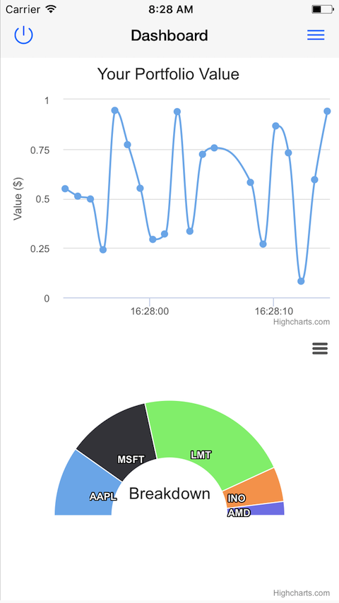
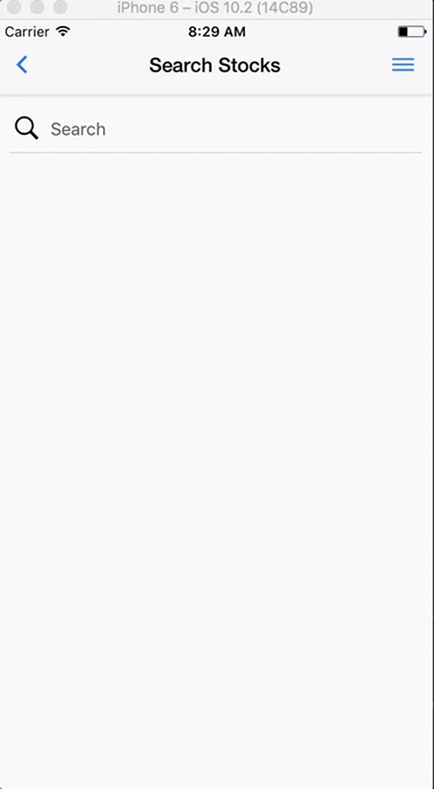
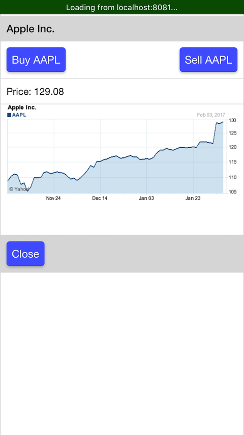

# Ticker Tycoon

In just one week of development, with no prior experience developing for iOS, this team produced a paper trading app to provide an easy opportunity for people to practice trading stocks without taking any real financial risks.

## Background

One fundamental problem with the current economy is that access to capital and well thought out investment strategies makes it easy for the wealthy to continually compound their wealth, whereas poor and middle-class people who do not have access to or experience with investment strategies tend to get left behind.

This app tackles this problem by giving anyone who is interested a chance to practice day trading. For some it may become a hobby, or even a passion or career.

### Technology

#### Front-end

This App is built for iOS with React Native and Redux.
Redux streamlines data flow and creates tighter integration between the various views.
React-Native enforces modularized view components written in ES6 following Facebook's prescribed best-practices.
React-Native also compiles the JavaScript view logic into iOS compatible code.
Additional data for searching ticker symbols and showing current stock prices and charts is fetched from Yahoo Finance on the front-end to alleviate load on our (free) Heroku host.

#### Back-end

A Postgres database persists all relevant account information as well as some stock data as required on a server hosted by Heroku.

The main backend application is written in Ruby on Rails, with two key gems stock_quote, and Jbuilder.

Finding a good free API from which to query financial data proved difficult. The stock_quote gem provides easy access to the Yahoo finance API, which satisfies our needs. It is worth noting that Yahoo's terms and conditions prohibit the use of their service for financial gain. This is learning endeavor and thus does not violate their conditions. The stock_quote gem is used to update stock prices once daily after trading closes, and also to create a balance record for each user once a day to keep track of their positions.

The Jbuilder gem helps render JSON objects that are sent to the React native front-end as needed.

## Images

Here are some sample images of what the App looks like on an iPhone:

Login page:

Portfolio overview:

Stock search page:

Stock show view:

## Future Directions

This project was a fun and interesting way to learn more about finance APIs and mobile app development. There are many directions in which we could continue to build this project out, including:

### Data Analytics

Eveyone loves to see charts and graphs, especially when they can help you understand something important. Lots of data is available for financial analytics, and it would be great to incorporate more of that into this project.

### Android Version

React-Native is a cross-platform mobile development framework. On a very short time-line it is best to focus on either iOS or Android. For this project we focused on iOS. One easy way to extend this project's reach would be to start building the Android version.

### Sharable Portfolios

It is fun to compare your market escapades with your friends. To make this app more social we may pursue sharable portfolios, either within the app or off into social networks. Similarly it could be lots of fun to create games or contests for users to join and compete in.
