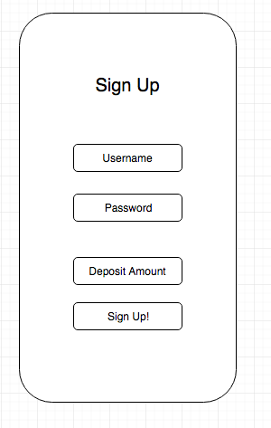
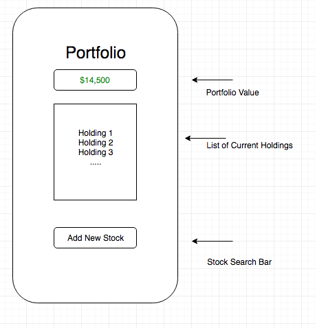
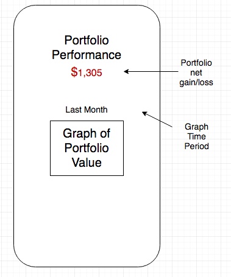
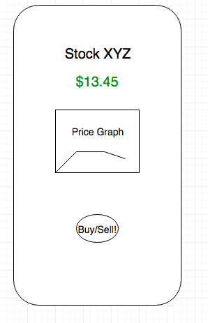

# flex-project

## Background

The growing chasm between rich and poor is undercutting the stability of our capitalist system. One factor leading in this disparity is a gulf in mentality between the investment-class and the working-class. This project seeks to provide every-day ‘average Joe’s’ with access to the wealth-creating tools used by investors.

The basic concept for this project is known as ‘paper trading.’ Users of our mobile/web app will be able to open ‘training accounts’ without spending (or earning) any real money. In their spare time, or whenever they fancy, users can check the current quote of stocks available on the NYSE, and manage a personal portfolio. Their trade histories, and portfolio balance will be available for review. Users will gain valuable experience in market trading through use of this app, and will be encouraged to either continue practicing (if they end up with losses) or to open a real account with real money if they show market savvy and end up with positive returns.

## Functionality & MVP

This app will meet the following specifications:

It will be implemented in React Native - available as a web-app and for mobile devices
Users will be able to sign up and log-in/log-out
Users will have individualized portfolios that track their cash and stock holdings
Users will be able to search for listings on the NYSE
Users will be able to view Show views of each stock with a chart and buy/sell button
Users will be able to buy and sell stocks, and their cash balance will reflect the results
Users will have access to a Portfolio overview showing their current holdings and charting the performance of their portfolio over time.

## Wireframes

## Technology & Technology Challenges

Backend - Ruby on Rails with Jbuilder
Frontend - React / React Native / Redux
APIs - finance/google.com and - or Yahoo finance API
Chartist.js for rendering of personal portfolio data visualizations

Challenges include:
How will we access NYSE data (finance API)
How will we store portfolio performance data over time (backend queries?)
How will we integrate this across platforms? (React Native is new to us)
How will we implement searchable Stock listings?

## Member Work Delegation

Kevin - backend engineer
Get recent/real-time stock data via Yahoo Finance (or similar) API
Store and update user portfolios on the back end
Construct API responses with jbuilder with relevant user information
Matt - frontend engineer
Design and build user interface via React Native presentational components
Implement Chartist library for user dashboard pie and line charts
Implement embedded stock charts on ticker show page using yahoo finance charting API
Torah - Project Manager
Identify relevant technologies and research implementation
Design Database Schema and API endpoints
Delegate tasks and respond to changing workloads and timelines
Assist with back-end API structure and front-end user experience

## Implementation Timeline

### Day 1
Torah - confirm API calls for all relevant data both for backend holdings updates and frontend user queries regarding potential stock values

Kevin -  Setup Rails project with basic user login functionality (auth)

Matt - Setup React project and design user login component

### Day 2
Torah - Work with Kevin to get trade and portfolios tables and models into backend and adhering to API result patterns. Also make sure Matt has clear picture of data available for Portfolio overview component

Kevin - Build tables for stocks and portfolios

Matt - design portfolio overview and stock show components

### Day 3
Torah - make sure Stock show component works with API queries to render stock charts and current price accurately. Implementation of debounced search for Ticker symbols.

Kevin - Build balances table to hold the current balance of each registered user at close of each trading day

Matt - Begin design of portfolio review component to show users their current portfolio value and owned stocks.

### Day 4
Torah - Work with Kevin to write API utils and ensure outside APIs are functioning correctly.
Kevin - Allow for querying of portfolio value on a given day. Finish writing API util methods.
Matt - Continue working on portfolio component. Render basic pie chart showing what percentage of portfolio each instrument is.

### Day 5
Torah - Text UI/UX, make sure navigation between “routes” is working correctly, help to implement front-end or back-end components that are behind schedule
Kevin - Ensure API is functioning correctly.
Matt - Finish styling of components, make sure charts render properly and are interactive to some degree (scrolling or buttons to change time scale).
